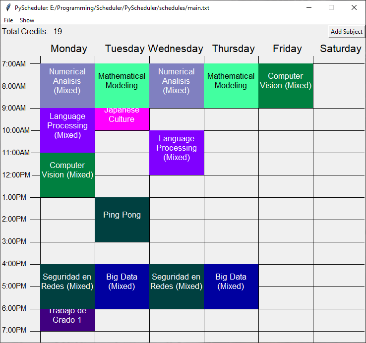
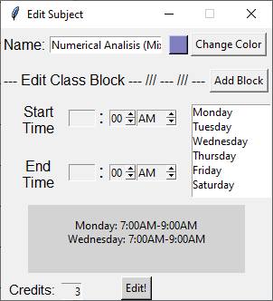

# PyScheduler 

This is a personal scheduler app written in python with Tkinter.

You can use it as a way to have a quick and easy way to make schedules and easily come back to them.

It allows for a simplistic level of customization, names colors, and times of course:

Feel free to use this in any way you like.